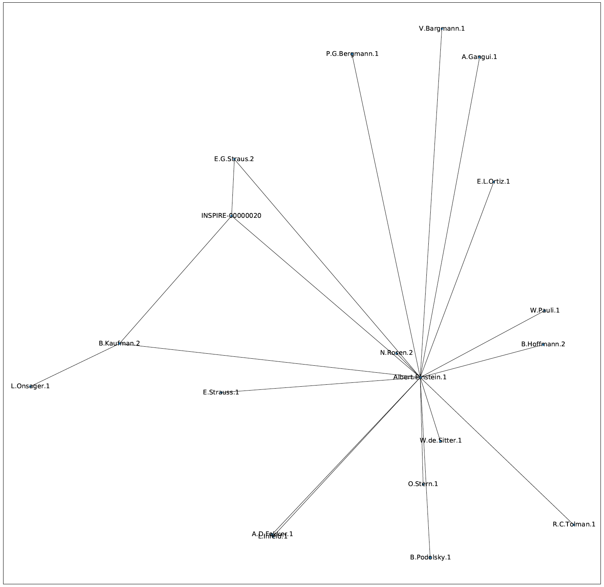

# INSPIRE Collaboration Graph

Scrape publication data from [INSPIRE-HEP](https://inspirehep.net/) to create a graph of collaborations using [Networkx](https://networkx.org/).

Read more about the INSPIRE API [here](https://github.com/inspirehep/rest-api-doc).

